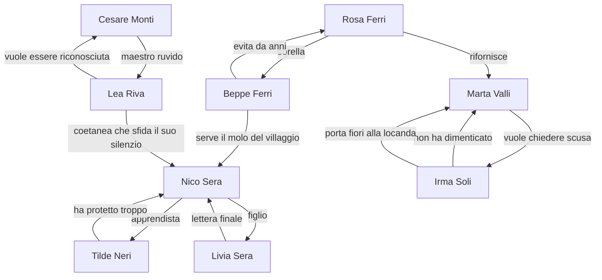

# Il Postino delle Stelle

Foundation pack narrativo per MVP mobile 16-bit.

## 0. Mini-audit del concept

### Perche funziona
La premessa ha una forza rara per un progetto indie piccolo: mette in contatto diretto tema, meccanica e payoff emotivo. Le lettere-stella non sono solo un elemento poetico, ma un dispositivo di gioco chiaro: trovare parole sospese, capire a chi appartengono, creare le condizioni perche arrivino a destinazione. Questo tiene il focus sull'umano, evita il worldbuilding superfluo e permette una struttura breve ma intensa.

### Output
Il concept regge bene se viene trattato come un racconto epistolare interattivo di piccola scala, non come una favola cosmica.

Punti forti da preservare:

- Tema leggibile e universale: i legami si spezzano piu spesso per silenzio che per malizia.
- Formula mobile sostenibile: esplorazione breve, consegna, cambiamento visibile del villaggio.
- Tono distintivo: malinconico ma caldo, poetico ma concreto.
- Potenziale di produzione controllata: piccolo villaggio, cast contenuto, dialoghi brevi, puzzle riusabili.

Rischi principali:

- Ripetitivita episodica se ogni consegna segue sempre lo stesso schema emotivo.
- Eccesso di lirismo se il testo rincorre la poesia invece della chiarezza.
- Fantastico confuso se si tenta di spiegare troppo l'origine delle stelle.
- Scope creep se si allarga il cast o si aggiungono troppe lettere secondarie.

Limiti produttivi consigliati per l'MVP:

- 5 capitoli.
- 5 lettere-cardine.
- 3 lettere minori opzionali.
- 4 famiglie di mini-puzzle con varianti leggere.
- 7 luoghi principali.
- 5 personaggi principali con arco forte.
- 4 personaggi secondari di supporto.

### Punti da decidere dopo
- Se il gioco debba includere una singola lettera minore per capitolo oppure tenerle tutte opzionali nel midpoint.
- Se alcuni cambiamenti del villaggio debbano essere solo visivi o anche funzionali al traversal.

## 0.1 Assunzioni, rischi e parti ancora deboli

### Perche funziona
Rendere espliciti i punti fragili prima della scrittura evita di costruire contenuti belli ma improducibili.

### Output
Assunzioni operative:

- Il protagonista e un adolescente del villaggio, gia inserito nella rete relazionale locale.
- Solo lui vede le lettere-stella.
- Il finale resta aperto sul piano fantastico, ma chiude con chiarezza l'arco emotivo.
- Il villaggio e costiero e collinare, cosi da offrire varieta visiva con una mappa compatta.

Parti deboli del concept da trattare con disciplina:

- La ferita del protagonista deve essere semplice, leggibile e non piu ingombrante delle altre storie.
- La lettera finale non deve sembrare piu importante perche cosmica, ma perche personale.
- Il villaggio deve cambiare abbastanza da far sentire il progresso, senza richiedere troppe varianti ambientali.

Rischi di design narrativo:

- Se ogni NPC ha un trauma troppo grande, il gioco perde delicatezza.
- Se le lettere dicono tutto da sole, i personaggi diventano passivi.
- Se i puzzle sono troppo astratti, il tema si scollega dal gameplay.

### Punti da decidere dopo
- Quanto spazio dare a Tilde rispetto agli altri adulti del villaggio.
- Se le lettere minori debbano essere firmate o volutamente anonime.

## 0.2 Decisioni narrative piu importanti

### Perche funziona
Queste scelte fissano il baricentro del progetto e prevengono incoerenze nei deliverable successivi.

### Output
Decisione 1: ferita del protagonista.

- Scelta: Nico evita di affrontare il dolore per la partenza e la morte della madre, Livia, e interpreta il silenzio finale come abbandono.
- Motivo: collega in modo organico la sua vocazione di postino al bisogno di ricevere, non solo consegnare, parole vere.

Decisione 2: regola del fantastico.

- Scelta: le lettere-stella compaiono dove parole importanti sono rimaste sospese; Nico puo vederle, raccoglierle e leggerne frammenti.
- Motivo: una sola regola chiara basta a sostenere tutto il gioco.

Decisione 3: grado di ambiguita del finale.

- Scelta: la verita emotiva e relazionale si chiude; la natura delle lettere-stella resta senza spiegazione definitiva.
- Motivo: protegge il tono poetico senza sacrificare la soddisfazione del finale.

Decisione 4: densita del cast.

- Scelta: 5 personaggi principali con arco pieno, 4 secondari funzionali.
- Motivo: abbastanza relazioni per dare spessore al villaggio, non cosi tante da diluire l'MVP.

### Punti da decidere dopo
- Se il gioco debba usare capitoli espliciti a schermo o una progressione piu discreta per giornate.

## 0.3 Direzione creativa complessiva

### Perche funziona
La direzione migliore non aggiunge complessita: organizza l'idea attorno a un ritmo di gioco solido e a un arco emotivo speculare.

### Output
Direzione raccomandata:

- Struttura notte-giorno: di notte Nico raccoglie lettere-stella e frammenti; di giorno capisce a chi appartengono e prova a consegnarle.
- Ogni consegna non risolve magicamente un rapporto: crea un piccolo spazio di verita, poi i personaggi fanno il resto.
- Ogni capitolo cambia leggermente il villaggio in modo leggibile su mobile: luci, oggetti, percorsi, presenze, routine.
- La storia sale di intimita: dagli altri abitanti, a Tilde, fino a Nico stesso.

Simboli ricorrenti consigliati:

- Finestre accese: disponibilita a farsi vedere.
- Pane caldo: cura trattenuta o finalmente condivisa.
- Lancette ferme: tempo emotivo bloccato.
- Ponti e moli: distanza breve ma difficile da attraversare.
- Condensa sui vetri della serra: parole presenti ma non ancora leggibili.

Metafora guida:

- Le stelle non sono destino. Sono parole rimaste in viaggio troppo a lungo.

### Punti da decidere dopo
- Se il motivo visivo dominante debba essere piu cielo notturno o piu luci calde nel buio.

## 1. Vision narrativa sintetica del gioco

### Perche funziona
La vision allinea tono, fantasy leggero, loop e promessa emotiva senza allargare lo scope.

### Output
*Il Postino delle Stelle* e un'avventura narrativa breve ambientata a Rivaquieta, un piccolo villaggio dove ogni notte compaiono stelle che custodiscono lettere mai consegnate. Nico, apprendista postino adolescente, e l'unico a poterle vedere. Raccogliendo queste parole sospese e portandole agli abitanti giusti, aiuta il villaggio a sciogliere silenzi antichi, piccoli orgogli e ferite mai nominate.

Il cuore del gioco non e salvare il mondo, ma creare momenti in cui le persone riescono finalmente a dire cio che conta. Ogni consegna cambia di poco il villaggio e, allo stesso tempo, avvicina Nico alla lettera piu difficile: quella che riguarda lui stesso.

### Punti da decidere dopo
- Se il sottotitolo interno debba essere foundation pack MVP o un nome piu evocativo per la documentazione.

## 2. Pillars narrativi ed emotivi

### Perche funziona
I pillars aiutano a valutare ogni scena, puzzle o personaggio senza perdere il focus.

### Output
### Pillar 1. Intimita prima di spettacolo
Ogni scena deve sembrare vicina, domestica e concreta. Il villaggio non ospita grandi eventi: ospita persone che non trovano piu le parole giuste.

### Pillar 2. Fantastico minimo, funzione massima
Le lettere-stella esistono per far emergere l'indicibile. Non servono spiegazioni cosmologiche, antiche profezie o gerarchie del cielo.

### Pillar 3. Piccoli cambiamenti, forte risonanza
Ogni consegna deve produrre un cambiamento modesto ma percepibile: un luogo si riaccende, un personaggio ricompare in piazza, un suono ritorna.

### Pillar 4. Malinconia calda
Il gioco puo essere triste, ma non freddo. Il dolore non e mai cinico. La cura resta possibile, anche quando la riparazione non e perfetta.

### Pillar 5. Il non detto come meccanica
La storia avanza perche mancano parole, non perche manca azione. Cercare, capire, ricomporre e consegnare sono tutte forme di ascolto.

### Punti da decidere dopo
- Se formalizzare questi pillars nel GDD come criteri di greenlight per contenuti e puzzle.

## 3. Premessa estesa in forma pulita e professionale

### Perche funziona
Questa versione e gia pronta per pitch interni, GDD e documentazione di produzione.

### Output
A Rivaquieta, un villaggio costiero raccolto tra una collina e un piccolo molo, le notti non sono mai completamente vuote. Nel cielo compaiono talvolta piccole luci erranti, simili a stelle cadute che non hanno ancora trovato terra. Nico, apprendista nell'ufficio postale del paese, scopre di poterle vedere da vicino: ciascuna contiene frammenti di una lettera mai arrivata, parole lasciate indietro da chi non ha saputo parlare in tempo.

Quando Nico raccoglie queste lettere-stella, il villaggio comincia lentamente a cambiare. Un forno spento torna a scaldarsi. Una locanda torna a riempirsi di voci. Un campanile riprende a segnare le ore. Ogni consegna rimette in moto un legame interrotto e lascia intravedere una verita semplice: molte relazioni non si spezzano per cattiveria, ma per paura, orgoglio o incapacita di dire cio che conta.

Mentre aiuta gli abitanti di Rivaquieta a dare finalmente un nome a cio che li tiene fermi, Nico si avvicina alla ferita che evita da anni. Tra i frammenti celesti che raccoglie ogni notte comincia ad affiorare anche una lettera che sembra parlare di lui, di sua madre Livia e di un addio rimasto sospeso. L'ultima consegna non sara la piu grande, ma la piu difficile: capire se certe parole arrivano dal cielo, dai ricordi o da entrambe le cose, e decidere comunque di ascoltarle.

### Punti da decidere dopo
- Se presentare fin dall'inizio il nome della madre o tenerlo implicito fino al quarto capitolo.
## 4. Struttura del gioco in 5 capitoli

### Perche funziona
La struttura cresce in profondita senza aumentare la scala. Ogni capitolo ha un payoff autonomo e prepara quello successivo.

### Output
| Capitolo | Obiettivo emotivo | Lettera-cardine | NPC focus | Puzzle focus | Cambiamento del villaggio | Payoff |
| --- | --- | --- | --- | --- | --- | --- |
| 1. Pane caldo | Mostrare che una consegna puo riaprire un rapporto bloccato dall'orgoglio. | Rosa -> Beppe | Rosa Ferri, Beppe Ferri | Ricomporre busta + seguire indizi tra forno e molo | Il forno torna acceso all'alba e il traghetto breve riparte. | I due fratelli fanno colazione insieme senza risolvere tutto, ma smettendo di evitarsi. |
| 2. La stanza in ordine | Portare il tema dalla famiglia all'amicizia e alla vergogna. | Marta -> Irma | Marta Valli, Irma Soli | Ricostruire una memoria in una stanza della locanda | La locanda torna ad avere fiori freschi e un tavolo apparecchiato ogni sera. | Marta chiede scusa senza difendersi; Irma non perdona del tutto, ma resta. |
| 3. Le lancette ferme | Mostrare che anche chi guida gli altri puo avere paura di mostrarsi fragile. | Cesare -> Lea | Cesare Monti, Lea Riva | Allineare lancette, corde e rintocchi | Il campanile riprende a suonare e diventa riferimento sonoro del paese. | Cesare smette di nascondere il tremore e chiede aiuto a Lea. |
| 4. La posta morta | Spostare il conflitto sul protagonista e su chi ha provato a proteggerlo male. | Tilde -> Nico | Tilde Neri, Nico Sera | Riordinare l'archivio e aprire un cassetto mai usato | L'archivio postale si apre e compaiono nuove lettere minori nel mondo. | Tilde ammette di aver trattenuto l'ultima lettera di Livia. |
| 5. L'ultima consegna | Chiudere l'arco di Nico con una verita emotiva e una scelta attiva. | Livia -> Nico | Nico Sera, Livia Sera, Tilde Neri | Percorso notturno di ricomposizione tra i luoghi gia vissuti | Le finestre del villaggio si accendono una dopo l'altra; resta un'ultima stella lontana. | Nico legge, risponde e sceglie di restare postino non per mancanza, ma per presenza. |

### Punti da decidere dopo
- Se usare un prologo giocabile molto breve prima del Capitolo 1.

## 5. Arco del protagonista

### Perche funziona
L'arco di Nico riflette il tema centrale: aiuta gli altri a rompere il silenzio finche non capisce che il suo silenzio e dello stesso tipo.

### Output
### Stato iniziale
Nico ha sedici anni, osserva molto e parla poco. E bravo a fare il suo lavoro perche sa notare dettagli, ricordare abitudini e passare inosservato. Usa l'efficienza come rifugio: consegnare e piu facile che domandare.

### Falsa convinzione
Se resta discreto e utile, non dovra mai esporre il proprio dolore. Crede che il compito del postino sia transitare nelle vite degli altri senza lasciarvi traccia.

### Bisogno reale
Capire che consegnare parole vere richiede presenza personale, non sola funzione. Per diventare davvero il postino del villaggio deve accettare di essere anche destinatario.

### Movimento dell'arco
Nel primo tratto Nico agisce come facilitatore esterno. Nel secondo inizia a riconoscere pattern comuni tra le lettere degli altri e la propria storia. Nel quarto capitolo scopre che Tilde gli ha nascosto l'ultima lettera della madre. La sua fiducia crolla e, con essa, l'idea rassicurante che il silenzio possa proteggere qualcuno. Nel finale sceglie di leggere fino in fondo, parlare ad alta voce e rispondere, anche senza ottenere tutte le risposte.

### Stato finale
Nico non guarisce dal dolore della perdita. Cambia il modo in cui lo abita. Smette di confondere l'assenza di parole con l'assenza d'amore e accetta che alcune lettere arrivino tardi, ma possano comunque contare.

### Punti da decidere dopo
- Se Nico debba pronunciare il proprio dolore in un'unica battuta chiave o in due momenti piu brevi.

## 6. Schede personaggi principali e secondari

### Perche funziona
Le schede mantengono allineati scrittura, scene e reattivita del mondo senza gonfiare la lore.

### Output
### Personaggi principali

| Personaggio | Ruolo | Ferita emotiva | Bisogno dichiarato | Bisogno reale | Comportamento difensivo | Rapporto con Nico | Cambiamento dopo la consegna |
| --- | --- | --- | --- | --- | --- | --- | --- |
| Nico Sera | Protagonista, apprendista postino | Si sente lasciato indietro dalla madre e protetto male da Tilde | Vuole solo fare bene il proprio lavoro | Vuole sapere se e stato amato abbastanza da essere cercato fino in fondo | Si rifugia nei compiti e parla per ellissi | E il centro di tutte le consegne | Accetta di ricevere e rispondere alle parole, non solo portarle |
| Tilde Neri | Direttrice dell'ufficio postale, mentore | Ha trattenuto una lettera per paura di ferire Nico | Vuole proteggerlo ancora | Deve chiedergli perdono e lasciarlo crescere | Controlla, omette, decide al posto degli altri | Figura adulta piu vicina a Nico | Da custode del silenzio diventa alleata della verita |
| Rosa Ferri | Fornaia | Dopo la morte del padre ha trasformato la cura in rigidita | Vuole che il fratello si rimetta in riga | Deve ammettere che lo ha spinto via | Parla per ordini, non per bisogni | Nico la osserva ogni mattina in piazza | Torna a condividere il pane e a chiedere invece di pretendere |
| Marta Valli | Locandiera | Ha ferito un'amica con parole dette nel momento peggiore | Vuole che tutto torni semplice come prima | Deve chiedere scusa senza chiedere assoluzione | Riempie i vuoti con operosita e gentilezza performativa | Offre a Nico un posto caldo ma evita le domande vere | Impara a restare in una conversazione scomoda |
| Cesare Monti | Orologiaio e custode del campanile | Nasconde il tremore delle mani e teme di diventare inutile | Vuole essere lasciato in pace | Deve accettare di essere visto nella fragilita | Si fa brusco, respinge l'aiuto, corregge tutti | Nico lo ammira e lo teme un poco | Chiede aiuto a Lea e smette di recitare autosufficienza |

### Personaggi secondari

| Personaggio | Ruolo | Ferita emotiva | Funzione narrativa | Relazione chiave |
| --- | --- | --- | --- | --- |
| Beppe Ferri | Traghettatore e fratello di Rosa | Si sente sempre il figlio che delude | Riceve la prima grande consegna e introduce il tema dell'orgoglio | Rosa |
| Irma Soli | Fiorista e custode della serra | Ha scambiato il silenzio per dignita, ma e ancora ferita | Mostra che il perdono non e immediato ne pulito | Marta |
| Lea Riva | Ex apprendista di Cesare, campanara | Interpreta la distanza come rifiuto personale | Porta energia giovane e specchia Nico in un'altra forma | Cesare |
| Livia Sera | Madre assente di Nico, ex postina | Ha provato a lasciare parole sufficienti senza riuscire a essere presente | Esiste come memoria, eco e lettera finale | Nico, Tilde |

### Punti da decidere dopo
- Se Beppe debba restare secondario o salire a co-protagonista del primo capitolo durante la scrittura dialoghi.

## 7. Mappa delle relazioni tra personaggi

### Perche funziona
La mappa rende chiaro che il villaggio e piccolo, intrecciato e memorabile senza trasformarsi in soap corale.

### Output

Rete di funzione narrativa:

- Rosa/Beppe mostrano il conflitto familiare.
- Marta/Irma mostrano il conflitto tra affetto e vergogna.
- Cesare/Lea mostrano il conflitto tra fragilita e orgoglio.
- Tilde/Nico/Livia portano il tema al suo centro piu personale.

### Punti da decidere dopo
- Se Lea debba avere un micro-legame esplicito con Marta o restare solo nell'asse Cesare-Nico.
## 8. Core loop narrativo-gameplay

### Perche funziona
Il loop e abbastanza chiaro da sostenere produzione e UX mobile, ma abbastanza elastico da evitare monotonia.

### Output
### Fase 1. Notte: individuare
Nico esplora una porzione compatta di Rivaquieta. Nota bagliori, suoni e scie di polvere stellare. Ogni lettera-stella richiede una breve azione per essere raccolta: avvicinarsi dal lato giusto, ricomporre i frammenti, sbloccare un piccolo percorso.

### Fase 2. Mattino: interpretare
Nell'ufficio postale o sul posto, Nico legge i frammenti raccolti. Non sempre l'indirizzo e esplicito: il giocatore usa luoghi, abitudini, oggetti e relazioni del villaggio per capire mittente e destinatario.

### Fase 3. Giorno: consegnare o facilitare
La consegna non e sempre dare una lettera in mano. A volte Nico crea il contesto giusto: porta una persona in un luogo, riattiva un oggetto, fa arrivare qualcuno all'ora giusta.

### Fase 4. Sera: osservare il cambiamento
Dopo ogni consegna, il villaggio reagisce. Si sblocca una nuova routine, un nuovo percorso, un nuovo suono o una nuova micro-scena. Questo cambiamento guida verso la notte successiva.

Regole pratiche per mobile:

- Ogni sessione ideale copre una singola fase del loop in 5-10 minuti.
- Nessuna schermata di dialogo deve superare 3-4 balloon consecutivi senza interazione.
- Le lettere principali devono potersi leggere in meno di 30 secondi.
- I puzzle devono tollerare fallimento morbido e input imprecisi.

### Punti da decidere dopo
- Se il giocatore possa rileggere tutte le lettere in un archivio o solo alcuni estratti.

## 9. Elenco delle lettere principali

### Perche funziona
Le cinque lettere-cardine coprono cinque variazioni dello stesso tema senza ripetersi.

### Output
| Lettera | Tema | Mittente | Destinatario | Conflitto | Hook di gameplay | Payoff emotivo | World-state delta |
| --- | --- | --- | --- | --- | --- | --- | --- |
| 1. Il pane del mattino | Orgoglio tra fratelli | Rosa Ferri | Beppe Ferri | Dopo la morte del padre, Rosa ha confuso il prendersi cura con il controllare; Beppe ha risposto sparendo. | Frammenti dispersi tra sacchi di farina e biglietti del traghetto. | Rosa riesce a dire mi mancavi senza trasformarlo in un rimprovero. | Forno acceso, profumo di pane in piazza, traghetto operativo. |
| 2. La stanza lasciata pronta | Vergogna e richiesta di perdono | Marta Valli | Irma Soli | Marta ha ferito Irma nel momento in cui lei stava gia perdendo un futuro immaginato fuori dal villaggio. | Ricostruire una stanza della locanda come memoria condivisa. | Irma non assolve subito Marta, ma accetta di tornare a parlarle. | Fiori alla locanda, nuova scena serale nel cortile. |
| 3. Le mani che tremano | Fragilita e dignita | Cesare Monti | Lea Riva | Cesare ha cacciato Lea per non farsi vedere indebolito; Lea ha letto quel gesto come disprezzo. | Allineare orologio, ingranaggi e rintocchi del campanile. | Cesare chiede aiuto per la prima volta in modo esplicito. | Campane attive, riferimento acustico, torre nuovamente vissuta. |
| 4. La lettera mai timbrata | Protezione che diventa omissione | Tilde Neri | Nico Sera | Tilde ha nascosto l'ultima lettera di Livia convinta che leggerla avrebbe fatto piu male del silenzio. | Ordinare l'archivio morto e trovare un cassetto bloccato. | Tilde smette di decidere per Nico e gli restituisce il diritto di sapere. | Archivio aperto, lettere minori disponibili, ufficio postale piu luminoso. |
| 5. La casa che resta accesa | Assenza, amore, scelta | Livia Sera | Nico Sera | Nico deve accettare che il silenzio della madre non equivale all'assenza d'amore, pur senza ottenere una riparazione completa. | Percorso notturno finale nei luoghi gia trasformati dal giocatore. | Nico legge, piange senza nascondersi e pronuncia la propria risposta. | Finestre accese nel villaggio; resta una stella lontana come eco, non come cliffhanger. |

Nota di design:
La lettera 5 puo contenere frasi non presenti nella lettera cartacea trattenuta da Tilde. Questo permette l'ambiguita finale: parte del contenuto viene dalla madre, parte forse da Nico, parte forse dalle stelle.

### Punti da decidere dopo
- Se la quarta e la quinta lettera debbano essere materialmente due oggetti distinti o la stessa lettera in due forme.

## 10. Lista di mini-puzzle coerenti con il tema

### Perche funziona
I puzzle diventano gesti di ascolto e ricomposizione, non ostacoli arbitrari.

### Output
| Puzzle | Famiglia | Fantasia narrativa | Azione del giocatore | Durata target | Fallimento morbido | Riuso sostenibile |
| --- | --- | --- | --- | --- | --- | --- |
| Ricomporre la busta | Ricomposizione | Una lettera si presenta in lembi stellari strappati | Trascinare e ruotare 4-6 frammenti | 30-60 s | Snap assistito e suggerimenti visivi | Alta |
| Seguire la scia | Tracciamento | Le parole cercano ancora la loro strada nel villaggio | Seguire un percorso luminoso evitando deviazioni | 20-40 s | La scia si riaccende dopo pochi secondi | Alta |
| Trovare il destinatario | Deduzione ambientale | L'indirizzo manca, ma gli indizi abitano il luogo | Toccare oggetti chiave e scegliere il destinatario corretto | 30-90 s | Tentativi illimitati con feedback contestuale | Alta |
| Rimettere la stanza com'era | Ricostruzione di memoria | Un luogo va riallestito come qualcuno lo ricorda | Spostare 3-5 oggetti nel posto giusto | 45-90 s | Gli oggetti corretti si fissano | Media |
| Regolare le lancette | Sincronia | Il tempo emotivo di Cesare e fermo | Portare le lancette all'ora di una memoria condivisa | 30-60 s | L'orologio si resetta senza penalita | Alta |
| Intrecciare la corda del campanile | Sequenza | Per far suonare il campanile servono gesti nell'ordine giusto | Toccare pulegge e nodi in sequenza | 30-60 s | Hint sonori dopo un errore | Media |
| Ordinare la posta morta | Classificazione | Il passato e rimasto incastrato negli scaffali | Smistare buste per simbolo, mittente o anno | 45-75 s | Le categorie scorrette tornano in evidenza | Alta |
| Ricostruire il percorso finale | Risonanza | Nico ripassa i luoghi che hanno cambiato il villaggio | Selezionare i luoghi nell'ordine emotivo corretto | 60-90 s | Prompt testuali minimi dopo ogni errore | Bassa ma finale |

Famiglie da tenere in produzione:

- Ricomposizione.
- Deduzione ambientale.
- Riattivazione di oggetti e spazi.
- Sequenze leggere legate ai rituali del villaggio.

### Punti da decidere dopo
- Se il gioco debba avere uno o due tutorial invisibili nel Capitolo 1 per ridurre testo di onboarding.

## 11. Tono di scrittura, regole di dialogo e linee guida stilistiche

### Perche funziona
Il tono protegge il progetto da due rischi opposti: diventare piatto oppure diventare troppo letterario.

### Output
### Tono generale
Poetico ma leggibile. Caldo ma non sdolcinato. Malinconico senza compiacimento. Le immagini devono nascere da oggetti quotidiani, non da metafore astratte troppo insistite.

### Regole di dialogo

- Battute brevi, con sottotesto visibile.
- Ogni personaggio deve avere una sintassi semplice e riconoscibile.
- Evitare monologhi lunghi e spiegazioni complete del passato.
- Lasciare che gli NPC cambino discorso, si correggano o tacciano.
- Far emergere il non detto tramite gesti, pause, oggetti e contesto.

### Lunghezze consigliate

- Dialoghi ordinari: 1-2 balloon per personaggio.
- Scene emotive principali: 4-6 scambi brevi.
- Lettere-cardine: 60-120 parole.
- Lettere minori: 25-60 parole.

### Lessico da privilegiare

- Oggetti concreti: pane, chiavi, vetri, corde, polvere, legno, luce.
- Verbi semplici: restare, portare, aspettare, aprire, trattenere, tornare.
- Immagini calde: finestre, mani, tavoli, soglie, campane, fiori.

### Da evitare

- Dialoghi programmatici che nominano il tema in modo esplicito.
- Frasi troppo aforistiche o da citazione.
- Lore cosmica, terminologia magica, mitologie delle stelle.
- Scene dove una lettera risolve da sola anni di conflitto.

### Dialogue ruleset pratico

- Ogni scena deve contenere almeno un elemento non verbale memorabile.
- Ogni battuta deve poter essere letta bene su schermo piccolo.
- Se una frase funziona solo come testo scritto ma non come voce del personaggio, va tagliata.
- I bambini e gli anziani non devono parlare per archetipi, ma per abitudini personali.

### Punti da decidere dopo
- Se mantenere tutte le lettere in italiano standard o inserire leggere inflessioni locali molto misurate.
## 12. Possibili finali, con raccomandazione

### Perche funziona
Valutare subito i finali impedisce che tutto il gioco converga verso una chiusura troppo vaga o troppo meccanica.

### Output
### Finale A. Aperto ma risolto emotivamente
Nico completa la lettera finale sul belvedere, legge la parte cartacea e quella stellare, poi lascia una propria risposta nella cassetta sul colle. Al ritorno, il villaggio ha le finestre accese e una sola stella resta lontana nel cielo. Non e chiaro se le lettere continueranno o se Nico abbia imparato finalmente a riconoscere le parole che c'erano gia.

Pro:

- Miglior equilibrio tra chiarezza emotiva e ambiguita poetica.
- Chiude l'arco del protagonista senza spiegare il fantastico.
- Lascia spazio a futuri contenuti senza sembrare un teaser artificiale.

Contro:

- Richiede grande precisione nel testo finale per non risultare evasivo.

### Finale B. Chiusura concreta del fenomeno
Dopo la lettera finale, le stelle smettono di comparire. Nico capisce che erano arrivate per lui e per quel preciso momento del villaggio.

Pro:

- Chiusura netta.
- Molto leggibile per un pubblico ampio.

Contro:

- Rende il fantastico troppo teleologico.
- Rischia di dare al protagonista un ruolo prescelto che il progetto non cerca.

### Finale C. Ambiguita radicale
La lettera finale potrebbe essere interamente una proiezione di Nico. Nessun segnale visivo finale conferma l'esistenza delle lettere-stella.

Pro:

- Molto coerente con un tono contemplativo.

Contro:

- Puo far sembrare retroattivamente meno concrete le consegne precedenti.
- Rischia di frustrare il payoff dell'MVP.

Raccomandazione:
Scegliere il Finale A. E il piu adatto al progetto perche difende il mistero senza compromettere la soddisfazione del giocatore.

### Punti da decidere dopo
- Se la risposta scritta da Nico debba essere leggibile per intero o solo parzialmente mostrata.

## 13. Backlog iniziale di contenuti narrativi per MVP

### Perche funziona
Un backlog narrativo concreto impedisce che il progetto resti in una fase di ideazione infinita.

### Output
| Item | Quantita | Priorita | Nota di produzione |
| --- | --- | --- | --- |
| Story brief per capitolo | 5 | Alta | 1 pagina max ciascuno |
| Chapter Card complete | 5 | Alta | Base per GDD e task design |
| Character sheet finali | 9 | Alta | Versione di writing e versione sintetica per design |
| Lettere-cardine scritte | 5 | Alta | Prima bozza + revisione tono mobile |
| Lettere minori opzionali | 3 | Media | Possono slittare dopo vertical slice |
| Scene dialogate principali | 20-25 | Alta | Include intro, reveal, payoff, finale |
| Barks reattivi del villaggio | 35-45 | Media | Brevi, contestuali ai cambiamenti del mondo |
| Puzzle Card complete | 8 | Alta | Una per ciascun puzzle del foundation pack |
| World-state checklist | 5 | Alta | Cosa cambia nel villaggio dopo ogni capitolo |
| UI copy narrativa | 30-40 stringhe | Media | Titoli capitoli, hint, archivio lettere |
| Style guide di scrittura | 1 | Alta | Derivata dalla sezione 11 |
| Script intro e outro | 2 | Alta | Devono fissare tono e promessa |

Ordine consigliato di produzione:

1. Chapter Card.
2. Character sheet.
3. Lettere-cardine.
4. Scene chiave per capitolo.
5. Puzzle Card.
6. Barks e lettere minori.

Taglio MVP se serve:

- Tagliare prima 2 lettere minori.
- Ridurre i barks reattivi.
- Riutilizzare una famiglia di puzzle in piu capitoli.
- Tenere intatti i 5 capitoli e le 5 lettere-cardine.

### Punti da decidere dopo
- Se produrre prima un vertical slice completo del Capitolo 1 o le bozze di tutti i capitoli in parallelo.

## 14. Rischi di scope creep e proposta per tenere il progetto piccolo ma significativo

### Perche funziona
La qualita del progetto dipendera piu da cio che viene escluso che da cio che viene aggiunto.

### Output
| Rischio | Segnale d'allarme | Effetto | Contromisura |
| --- | --- | --- | --- |
| Troppi NPC con backstory forte | Ogni luogo richiede un nuovo arco | Diluisce il tema e moltiplica il writing | Limitare gli archi completi ai 5 personaggi principali |
| Troppe lettere secondarie | Si scrivono piu lettere del necessario prima del vertical slice | Aumenta testo, QA e localizzazione | Bloccare il cap a 3 lettere minori per MVP |
| Puzzle troppo diversi tra loro | Ogni capitolo introduce una meccanica quasi nuova | Costi di design e UX fuori scala | Riutilizzare 4 famiglie con skin narrativa diversa |
| Finale troppo criptico | Le revisioni chiedono continue spiegazioni | Perdita di payoff e chiarezza | Testare il finale come scena emotiva, non come twist |
| Lore in espansione | Compaiono domande su origini, regole, eccezioni delle stelle | Il gioco si allontana dal suo cuore umano | Regola interna: mai introdurre una spiegazione se non migliora una relazione |
| Dialoghi troppo lunghi | Le scene superano i tempi mobile | Sessioni pesanti e lettura stancante | Tagliare tutto cio che non cambia stato emotivo o informativo |
| Reattivita ambientale troppo costosa | Ogni consegna richiede nuove versioni complete delle mappe | Costi artistici e scripting alti | Prediligere cambiamenti selettivi: luci, props, routine, suoni |

Proposta di disciplina produttiva:

- Pensare il villaggio come un teatro di 7 luoghi con stati, non come una mappa da espandere.
- Trattare ogni capitolo come una unita autoportante da verticalizzare.
- Validare presto il tono con un singolo capitolo completo, non con bozze sparse.
- Misurare ogni contenuto con una domanda: aumenta la chiarezza emotiva del gioco oppure lo rende solo piu grande?

### Punti da decidere dopo
- Se introdurre una checklist formale di scope gate prima di approvare nuovi NPC o nuove lettere.

## Appendice A. Luoghi principali di Rivaquieta

### Perche funziona
Un villaggio piccolo ma memorabile ha bisogno di pochi luoghi forti e facilmente riconoscibili.

### Output
| Luogo | Funzione | Immagine guida | Stato iniziale | Stato finale |
| --- | --- | --- | --- | --- |
| Ufficio Postale | Hub, archivio, lettura lettere | Scaffali di legno, timbri, luce calda | Ordinato ma chiuso | Piu aperto, vissuto, meno trattenuto |
| Piazza del Pozzo | Nodo sociale | Pietra chiara, panchina, piccioni | Di passaggio | Piu abitata e sonora |
| Forno Ferri | Capitolo 1 | Vapore e farina nell'aria | Mezzo spento | Attivo e profumato |
| Locanda Luna Bassa | Capitolo 2 | Tavoli vuoti, lampade basse | Accogliente ma fredda | Piu viva, fiori e presenze |
| Serra di Irma | Capitolo 2 | Vetri appannati, vasi, verde trattenuto | Bella ma chiusa | Piu aperta e luminosa |
| Bottega di Cesare e Campanile | Capitolo 3 | Ingranaggi, corde, rintocchi | Tempo fermo | Tempo condiviso |
| Molo Vecchio e Belvedere | Capitoli 1 e 5 | Acqua scura, lampare, cielo largo | Sospeso | Riconciliato ma non concluso del tutto |

### Punti da decidere dopo
- Se la casa di Nico debba essere un luogo separato o integrato nel belvedere per ridurre asset.

## Appendice B. Raccomandazione finale di direzione creativa

### Perche funziona
Chiude il foundation pack con una scelta netta, utile per il GDD e per ogni decisione successiva.

### Output
La miglior direzione creativa per *Il Postino delle Stelle* e quella di un racconto epistolare intimo, costruito su un villaggio compatto, cinque relazioni principali e una sola regola magica. Il gioco deve far sentire che le parole contano perche arrivano in ritardo ma arrivano ancora, e che ogni piccola consegna cambia un gesto, una stanza o una routine prima ancora di cambiare un destino.

La priorita non e stupire con la lore, ma rendere memorabili le persone. Se il team protegge questa scala, il progetto puo diventare piccolo ma incisivo, poetico ma leggibile, sostenibile da produrre e abbastanza forte da espandersi in GDD, dialoghi, quest e content pipeline.

### Punti da decidere dopo
- Nessuno strutturale. Il foundation pack e pronto per essere esteso in documentazione di pre-produzione.
